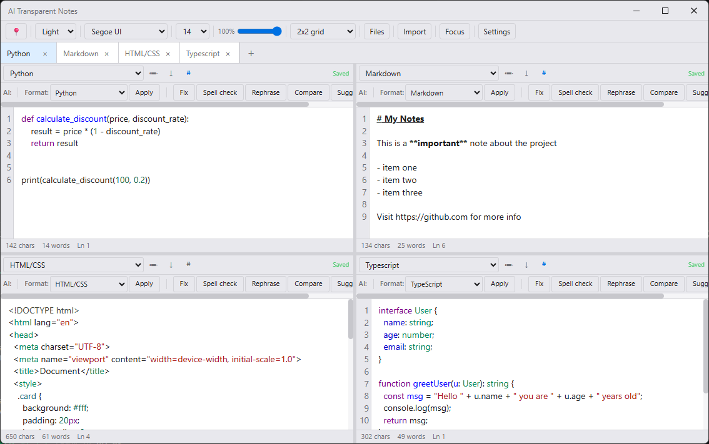
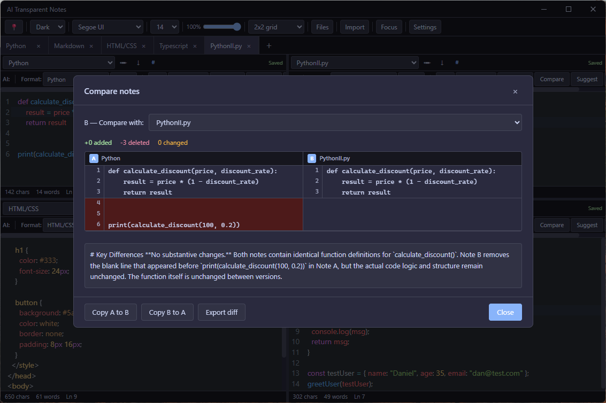
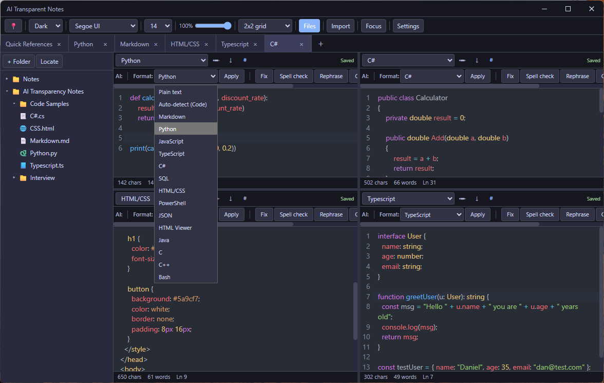

# AI Transparent Notes v2

A cross-platform desktop notes app with multi-pane layouts, AI writing tools, and real-time diff highlighting. Built with Tauri 2.0, React 19, TypeScript, and CodeMirror 6.

## Screenshots

<table>
  <tr>
    <td width="50%"></td>
    <td width="50%"></td>
  </tr>
  <tr>
    <td align="center">Multi theme, syntax highlighting</td>
    <td align="center">Dark theme, compare dialog</td>
  </tr>
  <tr>
    <td width="50%"></td>
    <td width="50%"></td>
  </tr>
  <tr>
    <td align="center">Workspace panel and format options</td>
    <td align="center">Always-on-top transparent overlay</td>
  </tr>
</table>

## Features

### Core

- Up to 8 note tabs, renameable by double-click on the tab label or via the pencil button in each pane
- Layouts: single pane, side by side, top/bottom, and 2x2 grid
- Draggable dividers between panes; each pane has an independent note and format selector
- Per-pane export: save as .txt, .md, or the current format's file extension
- Auto-save with 400ms debounce; file-backed notes write back to their source file on disk
- Scratch notes (stored in settings) and file-backed notes (opened via Import or workspace double-click)
- Save button in each pane header: green "Saved" when clean, amber "↓ Save" (with border, clickable) when unsaved, muted "Saving..." during the write. Ctrl+S also saves the focused pane. Tab bar shows an amber dot on unsaved tabs.
- Tab language dots: colored 6px circle per format (Python=blue, JavaScript=yellow, TypeScript=blue, Rust=orange, SQL=green, HTML/CSS=red, Markdown=purple)

### Workspace panel

- Collapsible left sidebar toggled from the main toolbar
- Add folders via button or drag a folder from Windows Explorer onto the window
- Lazy-loaded file tree with language icons (.py=🐍, .js=📜, .ts=📘, .rs=🦀, .md=📄, .json=🗂, .html=🌐, .css=🎨, .sql=🗃, .java=☕, .c/.cpp/.h=⚙)
- Single-click to highlight, double-click to open file in the active pane
- Right-click context menu: open in active pane, open in new tab, remove from workspace
- Duplicate tab detection: switches to the existing tab instead of reopening the same file
- Real-time file system sync via the Tauri watch plugin
- Resizable panel via drag handle

### AI features

API calls run from Rust via a `call_ai` Tauri command (reqwest), bypassing webview network restrictions.

| Action | What it does |
|---|---|
| Fix | Finds and fixes syntax errors, logic errors, and bugs in code |
| Polish | Improves grammar, clarity, and flow while keeping the original meaning |
| Rephrase | Rewrites text to be clearer and more concise |
| Convo | Rewrites in a natural, conversational tone, removing formal or stiff phrasing |
| Spell check | Fixes spelling errors only, no other changes |
| Suggest | Suggests improvements or a natural continuation of the note |
| Apply | Formats and cleans content using the selected format's rules |
| Auto-detect (Code) | Detects the programming language, formats the code, and shows the detected language in the status bar |
| Compare | Opens a side-by-side diff of two notes with AI summary, copy A to B / B to A, and export diff |
| HTML Viewer | Renders the current note as a live webpage in a separate preview window |

After every AI action (Fix, Polish, Rephrase, Convo, Spell check, Suggest, Apply) a result dialog opens showing the original and AI result side by side with diff highlighting. Choose "Apply changes" to keep the result or "Revert" to discard it. An optional AI summary can be generated. Changes can be exported as a .diff file.

Supported providers: Claude (Anthropic) and OpenAI. Provider, model, and API key are set in Settings.

AI errors appear as a red banner above the status bar in the affected pane, auto-dismissed after 8 seconds or on click. Error messages distinguish: no API key, invalid key (401), rate limit (429), timeout, and network failure.

### Editor

**Syntax highlighting** via CodeMirror 6, applied instantly when a format is selected:

Python, JavaScript, TypeScript, Java, C, C++, C#, Rust, SQL, HTML/CSS, CSS, Markdown, JSON, XML, Bash/Shell, PowerShell

Dark and Blue themes use the CodeMirror oneDark color scheme. Light, Sepia, and Green themes use the default light syntax colors. Changing themes reconfigures syntax colors instantly, no editor rebuild.

**Other editor features:**

- Line numbers: per-pane toggle (#) in the pane header, default controlled in Settings. Persisted per pane.
- CSV table view: a "Table" toggle in the pane header renders the CSV as a styled HTML table (updates with 400ms debounce). Auto-enabled when a .csv file is imported.
- Format switching: switching away from RTF or HTML-bearing formats automatically strips markup so the next editor sees clean plain text.

### Format toolbars

Selecting RTF, CSV, or XML reveals a format-specific toolbar row immediately below the AI toolbar. It hides automatically when any other format is chosen.

**RTF toolbar (two rows)**

Row 1: Style dropdown (Normal, Heading 1-3, Title, Subtitle, Quote, Code), Bold, Italic, Underline, Strikethrough, Font family, Font size, Font color (20-color swatch picker), Highlight color (swatch picker), Alignment (Left/Center/Right/Justify).

Row 2: Margin dropdown (Normal/Narrow/Wide/Mirrored), Indent increase/decrease, Page size dropdown (A4/Letter/Legal/A3), Bullet list, Numbered list, Insert table (8x8 grid picker), Insert image placeholder, Insert horizontal rule, Show/hide formatting marks, Quick style dropdown, Clear formatting.

**CSV toolbar (two rows)**

Row 1: Merge cells, Number format dropdown (General/Number/Currency/Percentage/Date/Time/Scientific/Text), Increase/decrease decimal places, Sort A-Z/Z-A, Toggle filter row, Insert row, Delete row.

Row 2: Insert column, Header row toggle (marks first row as header, excluded from sort), Transpose (swaps rows and columns), Delimiter selector (Comma/Tab/Semicolon/Pipe).

**XML toolbar (two rows)**

Row 1: Wrap selection in tag (inline tag name input), Unwrap surrounding tag, Collapse all/Expand all, Format (pretty-print, 2-space indent), Minify (single line), Validate (inline success/error banner).

Row 2: Add attribute (inline name/value inputs), Insert child element, Insert sibling element, Insert comment, Insert CDATA, Navigate Prev/Next/Parent, XPath search with match count.

### AI toolbar

The toolbar layout per pane:

`[‹] AI: | Format: [dropdown] [Apply] | [Fix] [Spell check] [Rephrase] [Convo] [Compare] [Suggest] [Polish]`

The `‹` button at the far left collapses all toolbar rows (AI toolbar + any active contextual toolbar) to free up editor space. A slim `›` strip remains so you can expand again.

- **Keyboard shortcut:** Ctrl+Shift+T (Cmd+Shift+T on Mac) toggles the collapse for the focused pane
- Each pane collapses independently
- On mobile (under 768px) toolbars start collapsed by default
- All action buttons are uniform height (28px) with a minimum width for visual consistency

### HTML Viewer

Select "HTML Viewer" from the format dropdown and click Apply to open the current note as a live webpage.

- Opens a separate 1000x700 resizable window titled "HTML Preview"
- Rendered in an iframe via Tauri's internal asset server
- A temp file is also written so "Open in browser" opens the exact content in the default browser
- Window opacity matches the main window in real time as the slider changes
- Toolbar: Refresh, Open in browser, Close
- Non-blocking: main window stays usable while the preview is open

### Themes

Five built-in themes via CSS custom properties: Dark, Light, Blue, Sepia, Green. Platform accent: blue (#5a9cf7) on Windows, purple (#7c6af7) on macOS.

### Window controls

- Frameless window with custom titlebar (Windows/Linux: custom min/max/close; macOS: native traffic lights space)
- Resizable, minimum size 600x400
- Always on top toggle
- Opacity slider (20% to 100%), native window transparency via Tauri's transparent window mode. The main toolbar uses a frosted glass effect so it remains readable at low opacity.
- Focus mode: hides all chrome (titlebar, toolbar, tab bar, workspace panel, pane headers, AI toolbars, status bars) so only the editor content shows
- System tray: Show/Hide, New note, Exit

### Focus mode

Two floating controls appear in the top-right corner of the window when focus mode is active:

- **Exit focus** — click to exit, or press Escape, or double-click the editor area
- **Move (⠿)** — mousedown and drag to reposition the entire app window using native OS window dragging

The Focus button in the main toolbar shows an active state while focus mode is on. Focus mode state is persisted to settings and restores on next launch.

### Settings

The settings dialog is scrollable and divided into these sections:

- **AI configuration** — provider (Claude/OpenAI), model filtered by provider, API key with show/hide toggle
- **Appearance** — theme, font family (12 options), font size (14 sizes), show line numbers by default
- **AI toolbar** — drag-and-drop reorderable list of AI action buttons; use ▲/▼ or drag handles to reorder, × to remove, dropdown to add
- **Main toolbar** — drag-and-drop reorderable list of main toolbar items
- **Format options** — drag-and-drop reorderable list; add custom language/format names, remove built-ins
- **Comparison colors** — hex color inputs with live swatches for added, deleted, and changed diff lines
- **Storage** — data folder path with Open button to reveal in file manager
- **About** — app icon, description, version

All three reorderable lists support HTML5 drag-and-drop with a visual drop-target indicator, plus Up/Down arrow buttons as an alternative.

A "Reset to defaults" button restores all settings to their original values.

## Download and install

### Windows

1. Go to the [Releases page](https://github.com/danhino/ai-transparent-notes-v2/releases)
2. Download `ai-transparent-notes-v2_x64-setup.exe`
3. Double-click and follow the prompts
4. Launch from the Start menu or desktop shortcut

No additional software required. WebView2 installs automatically if not already present. Compatible with Windows 10 and Windows 11 (64-bit).

### macOS

macOS support is coming soon.

### Settings storage

Your notes and settings are saved here:
- Windows: `%APPDATA%\com.danhi.ai-transparent-notes\settings.json`
- macOS: `~/Library/Application Support/com.danhi.ai-transparent-notes/settings.json`

## First launch — AI setup

To use AI features you need an API key from one of these providers:

**Claude (Anthropic) — recommended**
1. Go to https://console.anthropic.com
2. Sign in and click API Keys in the sidebar
3. Create a key and copy it

**OpenAI**
1. Go to https://platform.openai.com
2. Click API Keys in the sidebar
3. Create a new secret key and copy it

**Enter your key**
1. Open the app and click Settings in the toolbar
2. Under AI configuration select your provider
3. Paste your API key and click Save
4. Select your preferred model

## Troubleshooting

**App will not open on Windows 10**
Download WebView2 manually from:
https://developer.microsoft.com/microsoft-edge/webview2/

**AI features not working**
- Check your API key is entered correctly in Settings
- Verify you have API credits at console.anthropic.com or platform.openai.com
- Check your internet connection
- The app connects only to api.anthropic.com or api.openai.com. Allow these in your firewall if blocked.

**Workspace panel shows no files**
Click the folder button and select a folder, or drag a folder from Windows Explorer onto the app window.

**Windows firewall prompt on first launch**
Click Allow. The app needs internet access only for AI features. No other connections are made.

## Tech stack

| Layer | Technology |
|---|---|
| Desktop runtime | Tauri 2.0 (Rust) |
| Frontend | React 19, TypeScript |
| Build tool | Vite 7 |
| Editor | CodeMirror 6 |
| State | Zustand 5 |
| Animations | Framer Motion 12 |
| Diff | Custom LCS algorithm |
| Styling | Tailwind CSS 4, CSS custom properties |

## Project structure

```
src/
  types/index.ts          # All TypeScript types and defaults
  styles.css              # Theme variables and component styles
  stores/
    noteStore.ts          # Notes, active tab, unsaved tracking
    settingsStore.ts      # All persisted settings
    uiStore.ts            # Layout, panels, focus, per-pane UI state
  services/
    aiService.ts          # Claude and OpenAI API calls, all AI prompts
    diffService.ts        # Custom LCS-based line diff computation
    storageService.ts     # Tauri fs plugin read/write
  utils/
    languageMap.ts        # CodeMirror language extension per format
    csvParser.ts          # CSV row/column operations
    xmlUtils.ts           # XML format/minify/validate/XPath utilities
    rtfParser.ts          # RTF to HTML and HTML to RTF conversion
    textUtils.ts          # HTML stripping for format switching
  components/
    TitleBar.tsx          # Custom frameless titlebar with drag region
    Toolbar.tsx           # Main toolbar (pin, theme, font, opacity, layout, workspace, import, focus, settings)
    TabBar.tsx            # Tab bar with language dots, rename, unsaved indicator
    NoteEditor.tsx        # CodeMirror 6 wrapper with optional line numbers
    RichTextEditor.tsx    # contenteditable RTF editor
    AIToolbar.tsx         # Per-pane AI action buttons with collapse toggle
    DiffView.tsx          # Shared side-by-side diff component
    AiResultDialog.tsx    # Modal shown after every AI action (diff, apply/revert, export)
    DraggableList.tsx     # Reusable drag-and-drop reorderable list
    StatusBar.tsx         # Chars, words, line number, detected language
    Pane.tsx              # Individual pane: editor, toolbar, status bar, AI orchestration
    PaneSystem.tsx        # Layout manager with draggable splitters
    RtfToolbar.tsx        # RTF contextual toolbar (2 rows)
    CsvToolbar.tsx        # CSV contextual toolbar (2 rows)
    CsvTableView.tsx      # Renders CSV content as an HTML table
    XmlToolbar.tsx        # XML contextual toolbar (2 rows)
    WorkspacePanel.tsx    # Collapsible file tree sidebar with watch plugin
    SettingsDialog.tsx    # Settings modal
    CompareDialog.tsx     # Side-by-side diff with AI summary and copy/export
  App.tsx                 # Root: init, persistence, theme, focus mode, tray events
  main.tsx                # React entry point
src-tauri/
  src/
    lib.rs                # Tauri plugins, tray icon, window events
    main.rs               # Entry point
    commands/
      ai.rs               # call_ai Tauri command (reqwest HTTP to Claude/OpenAI)
      preview.rs          # HTML preview: open, close, sync opacity, open in browser
  capabilities/default.json  # Tauri permission grants
  tauri.conf.json         # App config: frameless window, tray, version
  icons/
    app-icon.svg          # Source icon (generated via `npx tauri icon`)
    icon.png              # 512x512 base PNG
    icon.ico              # Windows multi-size ICO
    icon.icns             # macOS ICNS
    32x32.png, 128x128.png, 128x128@2x.png
    Square*.png, StoreLogo.png  # Windows Store assets
public/
  icon.png               # 512x512 icon for browser tab favicon
  icon.ico               # ICO for browser tab favicon
```
